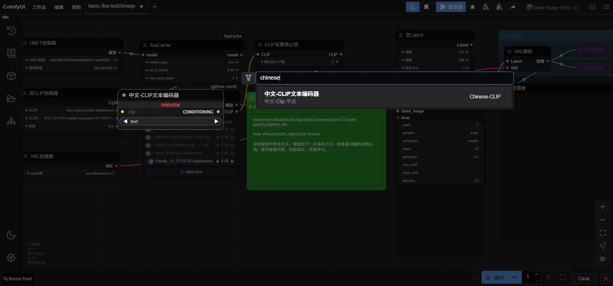

# 引用
基于Github上原作者：【yuan199696】-【chinese_clip_encode】代码库修改：https://github.com/yuan199696/chinese_clip_encode

# 新增
Github: https://github.com/leeneo/ComfyUI-Chinese-CLIP
中文标点转英文

# 声明
1. 支持中英文混输。
2. 基于 Python translate 库，提供翻译功能，可能耗时稍长，或有翻译失败的情况发生，若有此情况可再次尝试翻译或者进行手动翻译。

# 工作流示例

# 安装
ComfyUI>custom_nodes>Git Clone this Github: https://github.com/leeneo/ComfyUI-Chinese-CLIP

或者 通过 ComfyUI-Manager 节点搜索安装

